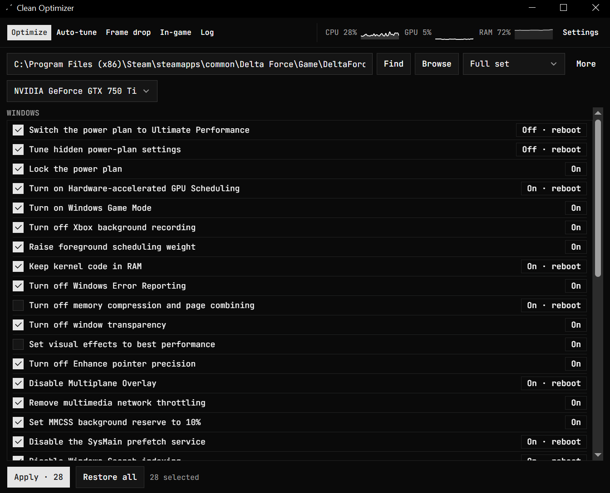

<p align="center">
  
</p>

<h1 align="center">Clean Optimizer</h1>

<p align="center">
  
  
</p>

<p align="center">
  
</p>

Windows settings for the Chinese Delta Force client (三角洲行动). Writes are backed up. The game install is not touched.

Looks for `DeltaForceClient-Win64-Shipping.exe`, `DeltaForceClient.exe`, or `DeltaForce.exe`.

```
bun install
bunx tauri build
```

Installer: `src-tauri\target\release\bundle\nsis\`
