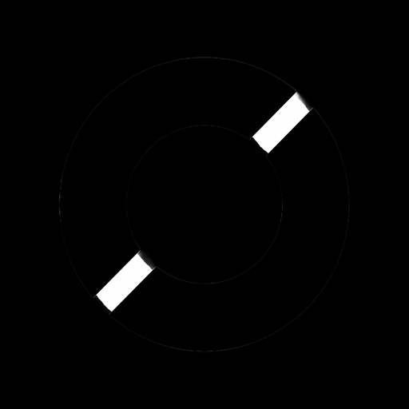

<p align="center">
  
</p>

<h1 align="center">Clean Optimizer</h1>

<p align="center">
  
  
  
</p>

Windows app. Writes registry, power plan, and service settings for the Chinese Delta Force client (三角洲行动). Each write is backed up. Restore puts the old value back. The game install is left alone.

Looks for `DeltaForceClient-Win64-Shipping.exe`, `DeltaForceClient.exe`, or `DeltaForce.exe`. Other clients are not supported yet. System items need administrator.

```
npm install
npx tauri build
```

Installer: `src-tauri\target\release\bundle\nsis\`. The release exe has no console window.
